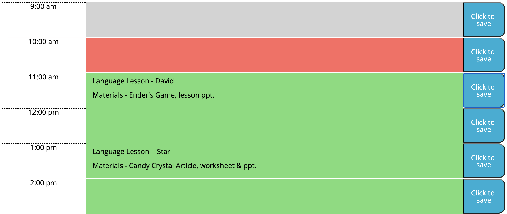
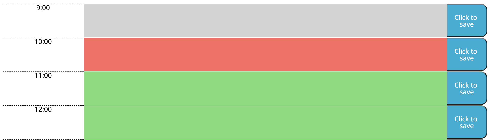
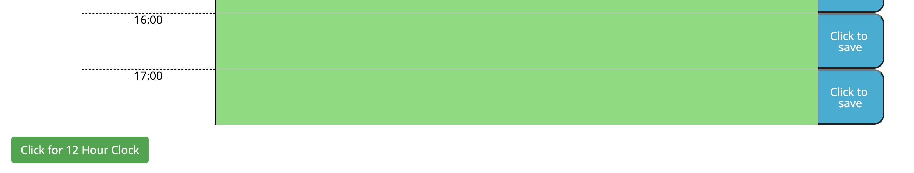
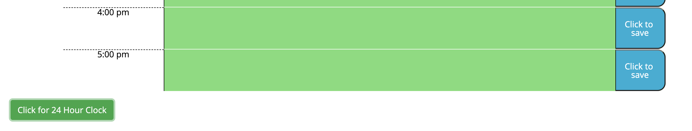

# Day-Planner
An application that allows the user to save events for each hour of the day. Built with dynamically updated HTML and CSS powered by JQuery.

This application is now live and deployed at: https://clatrobe00.github.io/Day-Planner/

This application allows the user to save events to 1 hour time blocks throughout the business day. The text for each hour is saved to localStorage.

The hour blocks are color coded based on the time of day - past items are grey, the present hour block is red, and future blocks are green.

Additionally, this application has functionality to toggle between a 12 and 24 hour clock- accessed by clicking the button at the bottom left of the page. The button is dynamic and will change based on which format is displayed.

